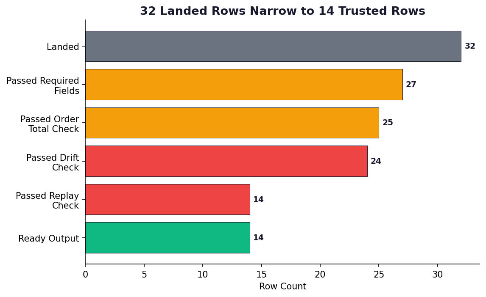
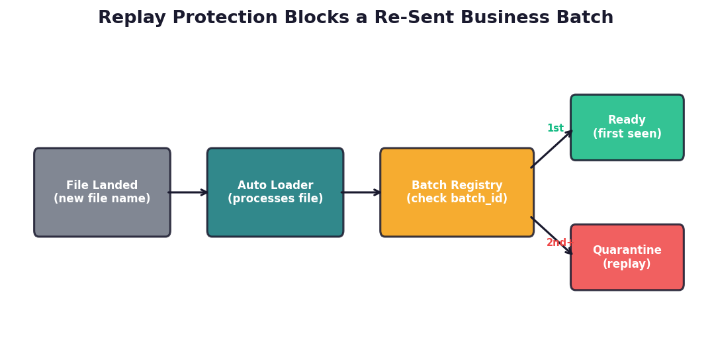
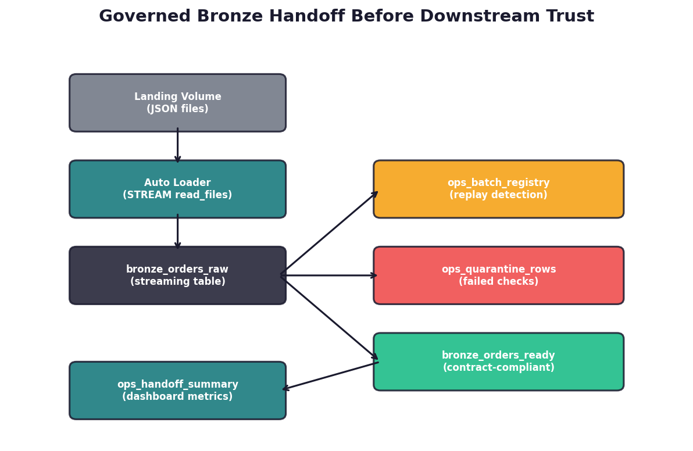

# Block Untrusted Landed Batches Before They Reach Trusted Bronze Tables

Built by Anthony Johnson | EthereaLogic LLC

`lakeflow_bronze_handoff_demo` is a public Databricks demonstration of a Bronze handoff control pattern for landed-file ingestion. It shows how to quarantine rows that fail contract checks, flag replayed business batches, and publish an operational summary before downstream Bronze, Silver, or analytics consumers trust the data.

The implementation uses Lakeflow Spark Declarative Pipelines, Auto Loader, Unity Catalog, and Declarative Automation Bundles to model the control in a public-safe way. The published local evidence is derived deterministically from the checked-in sample batches and handoff rules; live workspace validation still requires deploying the bundle and running the pipeline in Databricks.

## Executive Summary

| Leadership question | Answer |
| ------------------- | ------ |
| What business risk does this address? | Landed files can look operationally healthy while still carrying rescued drift, replayed business batches, or partial payloads that should not be trusted downstream. |
| What does this demo prove? | The local verification surface models `32` landed rows across four batches, leaves `14` ready for downstream use, quarantines `18`, flags `3` rescued-drift rows, and blocks `10` replay rows from the trusted path. |
| Why does it matter for technology leaders? | It demonstrates a practical control pattern for the operational boundary where files become trusted Bronze data, with inspectable quarantine evidence instead of silent failure. |

## The Business Problem

Most public Databricks examples start after data is already inside Bronze. Enterprise teams usually struggle earlier, at the point where landed files first become candidate Bronze data.

That is where quiet failures accumulate:

- A source adds, renames, or retypes a column.
- An operations team re-sends a batch under a different file name.
- An upstream extract partially fails, leaving required business fields null.
- Downstream consumers start reading Bronze before anyone has validated the batch.

If the handoff is weak, the platform can look healthy while downstream teams consume untrusted data. Technology leaders need a control that makes this boundary explicit, reviewable, and operationally visible.

## What This Demo Proves

The current verified local surface for this repository is:

| Verified outcome | Evidence from the repository |
| ---------------- | ---------------------------- |
| Repository verification contract | `pytest -q` completes with `37 passed`, and `ruff check src tests docs` passes. |
| Deterministic demo scope | Four landed batches exercise clean baseline, schema/type drift, duplicate replay, and partial payload scenarios. |
| Handoff outcome | The local evidence model derives `32` landed rows, `14` ready rows, and `18` quarantined rows. |
| Drift visibility | `3` rows fail the rescued-data handoff rule and remain out of the trusted path. |
| Replay protection | `10` rows fail the replay rule and stay out of `bronze_orders_ready`. |
| Operational transparency | The demo publishes quarantine reasons, batch-registry metadata, and an aggregate handoff summary for operator review. |

These counts come from the checked-in sample batches plus the documented handoff rules in the local evidence model. They are reproducible in this repository, but they are not a substitute for running the Lakeflow pipeline in a Databricks workspace.

## Verified Results

### Exhibit 1: 32 Landed Rows Narrow to 14 Trusted Rows

The local evidence model shows the full handoff funnel. Only `14` of the `32` landed rows clear every required, drift, and replay control before they are treated as ready for downstream use.

<p align="center">
  
</p>

### Exhibit 2: Replay Protection Blocks a Re-Sent Business Batch

Auto Loader protects against reprocessing the same file, but renamed re-sends are still a business risk. This demo adds a batch-registry control so replayed business batches are flagged and quarantined instead of slipping into trusted Bronze output.

<p align="center">
  
</p>

### Exhibit 3: The Bronze Handoff Control Is Explicit and Reviewable

The control surface is intentionally simple: raw ingest, batch registry, quarantine, ready output, and an operational summary. That makes it easier for platform and governance teams to review how trust is established before downstream consumption.

<p align="center">
  
</p>

## How the Control Works

1. Auto Loader ingests landed JSON files into `bronze_orders_raw` with rescued-data visibility turned on.
2. `ops_batch_registry` tracks first-seen batch and file combinations to catch business-level replay scenarios.
3. `ops_quarantine_rows` retains every row that fails at least one named handoff rule.
4. `bronze_orders_ready` publishes only rows that clear the required-field, rescued-data, and replay checks.
5. `ops_handoff_summary` aggregates ready, quarantined, rescued, and duplicate counts into a single operator-facing surface.

The technical architecture and scenario narrative live in [Architecture](docs/architecture.md) and [Case study](docs/case_study.md). The README stays focused on the operating problem and the control outcome.

## Databricks Fit

This repository is intentionally Databricks-native:

- A serverless Lakeflow pipeline handles the Bronze handoff path.
- Published datasets live in Unity Catalog, and landed files are staged in Unity Catalog volumes.
- The bundle includes both `dev` and `prod` targets so reviewers can see the intended promotion model.
- The pipeline event log remains the operational observability surface for update and expectation details.

## Quick Start

### 1. Create a local environment

```bash
python3.12 -m venv .venv
. .venv/bin/activate
python -m pip install --upgrade pip
python -m pip install -e ".[dev,docs]"
```

### 2. Run the local verification contract

```bash
pytest -q
ruff check src tests docs
```

Expected verified result:

```text
37 passed
```

### 3. Regenerate the README exhibits

```bash
python docs/generate_visuals.py
```

### 4. Validate and deploy the Databricks bundle

If you use a named Databricks CLI profile, export it first:

```bash
export DATABRICKS_CONFIG_PROFILE=<profile-name>
```

Review the `catalog`, `schema`, `landing_path`, and `checkpoint_root` variables in `databricks.yml`, then run:

```bash
databricks bundle validate --target dev
databricks bundle deploy --target dev
```

### 5. Seed sample files and run the pipeline

Run `notebooks/00_seed_demo_files.py` to copy the sample batches into the configured landing path, then start the pipeline:

```bash
databricks pipelines run --target dev
```

### 6. Review the published outputs

Open the pipeline update URL from the CLI, then query:

```sql
SELECT * FROM main.bronze_handoff_demo.ops_handoff_summary;

SELECT batch_id, quarantine_reasons, source_file_name
FROM main.bronze_handoff_demo.ops_quarantine_rows
ORDER BY batch_id, source_file_name;

SELECT batch_id, count(*) AS ready_rows
FROM main.bronze_handoff_demo.bronze_orders_ready
GROUP BY batch_id
ORDER BY batch_id;
```

## Event Log Queries

Databricks treats the pipeline event log as the primary observability surface for updates, quality metrics, and flow progress. After a refresh, capture the pipeline ID from the update URL or the pipeline details page, create a temporary view for that event log on a shared cluster or SQL warehouse, then run queries like:

```sql
CREATE OR REPLACE TEMP VIEW event_log_raw AS
SELECT * FROM event_log('<pipeline-id>');

SELECT timestamp, level, event_type, message
FROM event_log_raw
WHERE event_type IN ('create_update', 'flow_progress')
ORDER BY timestamp DESC
LIMIT 50;
```

```sql
CREATE OR REPLACE TEMP VIEW latest_update AS
SELECT origin.update_id AS id
FROM event_log_raw
WHERE event_type = 'create_update'
ORDER BY timestamp DESC
LIMIT 1;

WITH expectations_parsed AS (
  SELECT
    explode(
      from_json(
        details:flow_progress:data_quality:expectations,
        'array<struct<name: string, dataset: string, passed_records: int, failed_records: int>>'
      )
    ) AS row_expectation
  FROM event_log_raw, latest_update
  WHERE event_type = 'flow_progress'
    AND origin.update_id = latest_update.id
)
SELECT
  row_expectation.dataset AS dataset,
  row_expectation.name AS expectation,
  SUM(row_expectation.passed_records) AS passing_records,
  SUM(row_expectation.failed_records) AS failing_records
FROM expectations_parsed
GROUP BY row_expectation.dataset, row_expectation.name
ORDER BY dataset, expectation;
```

## Technical References

- [Architecture](docs/architecture.md)
- [Case study](docs/case_study.md)

## Repo Layout

```text
lakeflow_bronze_handoff_demo/
├── databricks.yml
├── resources/
│   ├── bronze_handoff.pipeline.yml
│   └── refresh_demo.job.yml
├── src/
│   ├── lakeflow_sql/
│   │   ├── 00_bronze_orders_raw.sql
│   │   ├── 10_ops_batch_registry.sql
│   │   ├── 20_ops_quarantine_rows.sql
│   │   ├── 30_bronze_orders_ready.sql
│   │   └── 40_ops_handoff_summary.sql
│   └── bronze_handoff_demo/
│       ├── __init__.py
│       ├── demo_metrics.py
│       ├── manifests.py
│       ├── rules.py
│       └── sample_data.py
├── notebooks/
│   ├── 00_seed_demo_files.py
│   └── 01_review_outputs.py
├── data/sample/
├── docs/
├── tests/
└── .github/workflows/ci.yml
```

## Public-Safe Boundaries

This repo is intentionally public-safe. It does **not** include:

- Customer data
- Client identifiers
- Proprietary formulas
- Production secrets
- Enterprise-specific IAM or network configuration

## Production Notes

This demo defaults to the simplest runnable path. For production, the next steps would typically be:

- Switch from simple directory discovery to Databricks file events for scale
- Use environment-specific catalogs and schemas
- Separate landing, checkpoint, and published paths cleanly
- Add alerting on quarantine spikes and replay detection
- Publish operational dashboards from `ops_handoff_summary`

## Future Enhancements

- Expectation rules stored in Unity Catalog tables
- Scheduled refresh job with notifications
- Change-data-capture extension
- Silver handoff contract
- Dashboard for quarantine trends and replay rate
